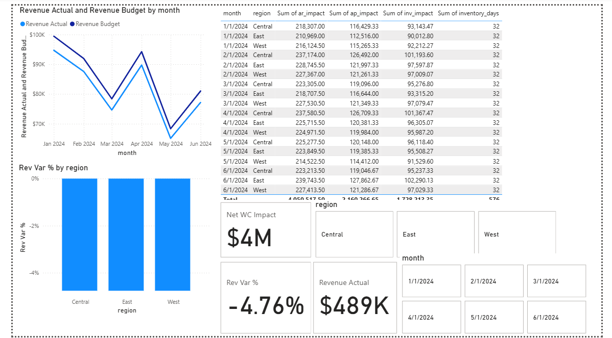

# 📊 FP&A Case Study – Working Capital & Revenue Analysis

**Tools:** Power BI • SQL • Excel  
**Data Type:** Synthetic (safe for public sharing)  
**Focus:** Revenue vs Budget analysis, Working Capital impact (AR, AP, Inventory)

---

## 📌 Project Overview
This project demonstrates my ability to perform **Financial Planning & Analysis (FP&A)** using **Power BI** and SQL.  
I built a dashboard to track and compare **actual vs budgeted revenue**, calculate **variance %**, and analyze **net working capital (NWC) impacts** across regions.

The analysis helps business stakeholders:
- Understand revenue performance by month & region
- Identify positive/negative variances
- Assess AR/AP/Inventory impacts on NWC

---

## 🗂 Data Sources
- **sales_actuals**: Actual revenue, units sold, and cost of goods sold (COGS)
- **sales_budget**: Budgeted revenue and COGS
- **cash_impact_multi_month**: Accounts receivable, accounts payable, inventory days & NWC calculations

---

## 📊 Dashboard Preview


---

## 📈 Key Insights
1. **Revenue Trends**: Month-over-month comparison of actual vs budget
2. **Variance Analysis**: % variance by region to highlight underperformance
3. **NWC Impact**: AR/AP/Inventory effects on net working capital

---

## 🔍 Features
- **Line Chart**: Month vs Actual & Budget Revenue
- **Bar Chart**: Revenue Variance % by Region
- **Table**: Month, Region, AR/AP/Inventory impact, NWC impact
- **KPI Cards**: Total Revenue, Variance %, Net WC Impact

---

## 🚀 How to Use
1. Clone this repo:
   ```bash
   git clone https://github.com/ansarmukhtar/FP-A-Portfolio.git
